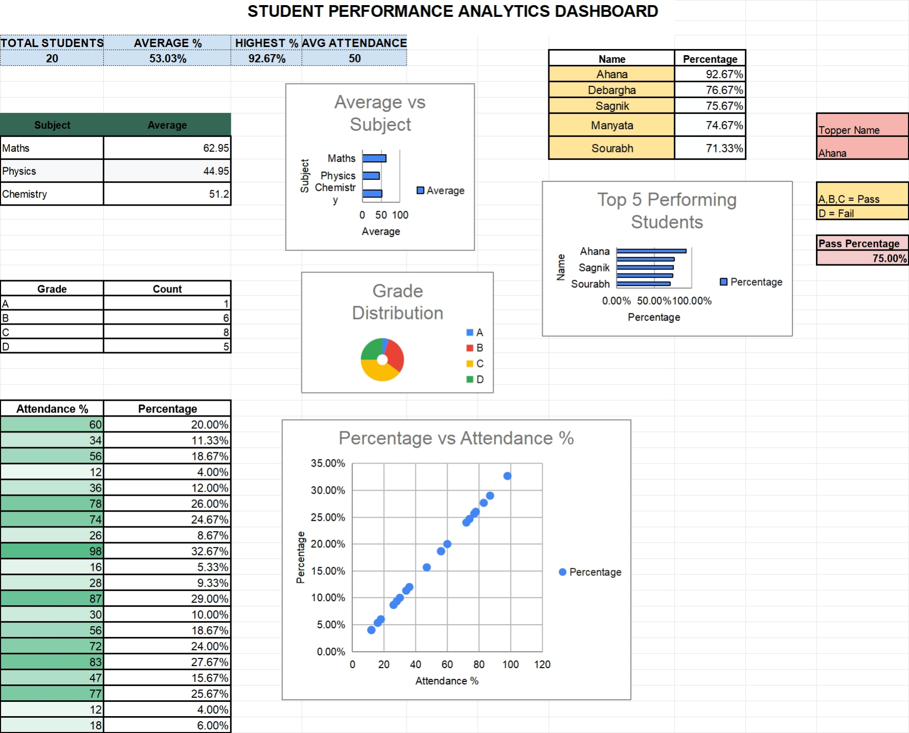

# Student Performance Analytics Dashboard

An interactive Microsoft Excel dashboard for analyzing student academic
performance, attendance, subject averages, grade distribution, pass rate, and
top performers.



## Project Overview

This project transforms student-level marks and attendance records into a
compact analytical dashboard. It is designed to help teachers, academic
coordinators, and analysts quickly identify performance patterns and students
who may need additional support.

## Dashboard Highlights

| KPI | Result |
|---|---:|
| Total students | 20 |
| Average percentage | 53.03% |
| Highest percentage | 92.67% |
| Average attendance | 50% |
| Pass percentage | 75% |
| Top-performing student | Ahana |

## Key Insights

- Mathematics has the highest subject average at **62.95**.
- Chemistry has an average score of **51.20**.
- Physics has the lowest subject average at **44.95**.
- The grade distribution is **1 A, 6 B, 8 C, and 5 D grades**.
- **15 of 20 students passed**, based on grades A, B, or C.
- Ahana achieved the highest overall percentage at **92.67%**.
- The dashboard includes a comparison of attendance and academic percentage.

## Features

- KPI cards for total students, average percentage, highest percentage, and
  average attendance
- Subject-wise average analysis
- Grade distribution chart
- Top-five student ranking
- Attendance versus performance visualization
- Pass/fail summary and topper identification
- Formula-driven totals, percentages, grades, and dashboard metrics

## Workbook Structure

### `Student_Data`

Contains the source dataset and calculated student results.

| Column | Description |
|---|---|
| Roll No | Unique student roll number |
| Name | Student name |
| Attendance % | Attendance percentage |
| Maths | Mathematics marks |
| Physics | Physics marks |
| Chemistry | Chemistry marks |
| Total Marks | Combined marks across all three subjects |
| Percentage | Overall score as a percentage |
| Grade | Assigned grade from A to D |

### `Dashboard`

Contains KPI summaries, supporting tables, and four charts:

1. Average score by subject
2. Grade distribution
3. Percentage versus attendance
4. Top five performing students

## Tools Used

- Microsoft Excel
- Excel formulas
- Charts and data visualization
- Conditional formatting
- Dashboard design and KPI reporting

## How to Use

1. Download [`Student-Performance-Dashboard.xlsx`](Student-Performance-Dashboard.xlsx).
2. Open it in Microsoft Excel.
3. Review or update records in the `Student_Data` sheet.
4. Open the `Dashboard` sheet to explore the updated analysis.

## Project Files

```text
student-performance-dashboard/
|-- Student-Performance-Dashboard.xlsx
|-- README.md
|-- assets/
    |-- dashboard-preview.png
    |-- average-by-subject.png
    |-- grade-distribution.png
    |-- attendance-vs-percentage.png
    |-- top-5-students.png
```

## Author

**Ahana Ganguli**

